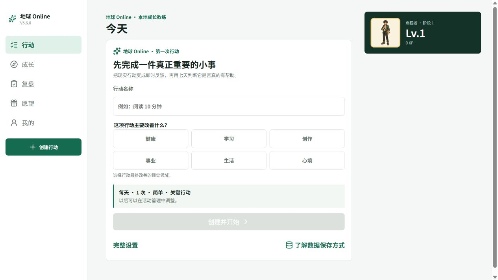

# 地球 Online

> README v0.1 · 正式版 V5.8.0 · 预览候选 V5.9.0

地球 Online 是一个手机优先、本地离线的个人成长教练。它把现实行动转化为即时反馈，再通过每周复盘和 28 天成长赛季，帮助使用者判断哪些行为真的改善了生活。



- **立即使用：[地球 Online 正式版](https://zhuyong1297-dev.github.io/life-rpg-pwa/)**
- 尝鲜功能：[手机预览版](https://zhuyong1297-dev.github.io/life-rpg-pwa/preview/)
- 稳定版本：[V5.8.0 Release](https://github.com/zhuyong1297-dev/life-rpg-pwa/releases/tag/v5.8.0)
- 反馈邮箱：[zhuyong1297@gmail.com](mailto:zhuyong1297@gmail.com)
- 问题与建议：[GitHub Issues](https://github.com/zhuyong1297-dev/life-rpg-pwa/issues)

## 它能做什么

- 管理每日行动、每周累计目标和一次性任务。
- 完成行动后立即获得 XP、金币和成长领域反馈。
- 用两层或三层目标降低开始门槛，同时保留进阶空间。
- 通过每周复盘、28 天赛季和评分记录检查现实效果。
- 使用愿望商店把金币对应到真正想要的现实奖励，并自行设置每月奖励基金。
- 从六个成长领域的推荐习惯开始，或把四套 28 天模板带入目标规划器逐项确认。
- 选择男性或女性旅者，并用时间、现实事件或上一项行动为习惯设置可选启动锚点。
- 在“我的 → 本次更新”查看当前版本新增内容和对应功能入口。
- 在本地离线运行，并通过 JSON 完整备份和恢复数据。

## 怎么使用

1. 用手机的系统浏览器打开[正式版](https://zhuyong1297-dev.github.io/life-rpg-pwa/)；从微信进入时，先通过右上角菜单转到系统浏览器。
2. Android Chrome 使用“安装应用”或“添加到主屏幕”；iPhone/iPad Safari 使用“分享 → 添加到主屏幕”。
3. 先创建一至三项真正重要、今天能够执行的行动。
4. 完成后立即记录；每周在“复盘”中判断行动是否有现实帮助。
5. 定期前往“我的 → 数据中心”导出完整 JSON 备份。

数据只保存在当前浏览器的 IndexedDB 中。微信、Chrome、Safari 和已安装应用可能使用彼此独立的本地存储，不会自动迁移或同步；卸载应用或清除站点数据前必须先导出备份。详细边界见[隐私说明](PRIVACY.md)。

## 当前进度

| 项目 | 状态 |
| --- | --- |
| 每日、每周和一次性行动闭环 | 可用 |
| XP、金币、六个成长领域与愿望奖励 | 可用 |
| 每周复盘、28 天赛季与本地建议 | 可用 |
| 离线安装、JSON 备份与恢复 | 可用 |
| Obsidian 规划上下文与知识行动包 | 实验性功能 |
| 账号、云同步和社交功能 | 不在当前范围 |

当前正式版运行 V5.8.0，预览版正在验收 V5.9.0 的双旅者与习惯启动锚点。数据契约仍为 Backup JSON schema 12、Dexie version 4 和八张表，并兼容恢复 schema 1～11。

## 90 天路线图

这份路线图记录项目从“个人可用”走向“他人能够独立使用”的过程。进度以真实使用、Issue 和可验证交付为准，不以新增功能数量为准。

| 阶段 | 目标 | 验收信号 |
| --- | --- | --- |
| 第 0～3 天 | 建立开源使用前提 | MIT 许可证、README v0.1 和本路线图进入仓库 |
| 第 4～30 天 | 让第一次使用足够顺畅 | 至少一位新使用者能独立安装、创建行动、完成记录和导出备份；把阻塞记录为 Issue |
| 第 31～60 天 | 修复真实使用中的高频阻力 | 优先解决可靠性、移动端操作、离线与恢复问题；每项改动有复现步骤和验证结果 |
| 第 61～90 天 | 形成可审查的维护证据 | 发布阶段总结，整理已完成 Issue、实际使用反馈、已知限制和下一阶段计划 |

路线图会根据证据调整。删除或改变目标时保留 Git 历史，并在 Issue 或 Release 中说明原因。

## 本地开发

```bash
pnpm install
pnpm dev
```

预览环境运行 `pnpm dev:preview`。预览版使用独立数据库，不会读取或修改正式版数据。

提交变更前运行：

```bash
pnpm test
pnpm build
pnpm test:e2e
pnpm privacy:scan
```

## 数据与隐私

- IndexedDB 八张表是唯一事实来源，不需要账号或后端。
- 完整备份和 Obsidian 知识行动包是两种不同的 JSON，使用不同入口和事务，不能互相恢复。
- 公开仓库只包含通用代码与人物素材，不包含个人活动、账本、备份或凭据。
- 虚构交换示例位于 [`examples/`](examples/)。

## 分支与部署

`main` 是正式版来源，`ui-redesign` 是手机预览来源。GitHub Actions 分别部署到 `/life-rpg-pwa/` 和 `/life-rpg-pwa/preview/`；两个入口使用不同的 IndexedDB、manifest 和 Service Worker 范围。

## 许可证

本项目采用 [MIT License](LICENSE)。你可以使用、修改和分发代码，但须保留原版权和许可声明。
